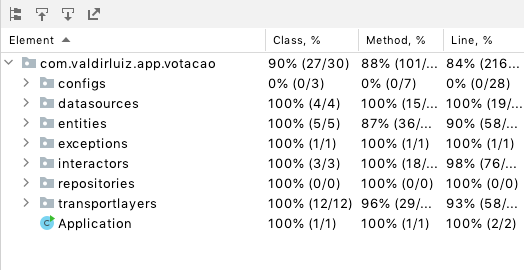

# Api de votação

## Ambiente e execução

O sistema foi desenvolvido utilizando a seguinte stack:

- Java 17
- Maven 3
- Spring boot

Para rodar o projeto basta executar o comando:

```
mvn spring-boot:run
```

Após isso o sistema estara disponível em :

http://localhost:5000/api-votacao/swagger-ui/#/

ou se preferir pode acessar o mesmo hospedado na nuvem em:

https://valdirluiz-desafio-votacao.herokuapp.com/api-votacao/swagger-ui/

Os testes podem serem feitos via swagger (links acima) ou para facilitar pode se usar a collection do postman`valdirluiz-desafio-api-votacao.postman_collection.json` da raiz do projeto.


## Escopo

Este projeto consiste em uma API de votação, tendo como principais funcinalidades:

- Cadastro e consulta de pautas
- Criação e consulta de sessões
- Votação em pautas
- Apuração por pautas e sessões
- Validação de cpf via sistema externo
- Criação de swagger para documentação da api
- Criação de testes unitários
- Log das entradas e saidas http
- Configurações de Observability

## Arquitetura

A arquitetura escolhida para desenvolver o sistema foi a hexagonal utilizada pela netflix, com algumas adaptações para evitar o over engineering. As camadas da aplicação são:

- configs: Responsável pelas configurações do projeto.
- datasources: Responsável por acessar dados, sejam eles de bancos ou outros sistemas.
- entities: Entidades do domínio, com uma adaptação buscando evitar over engineerin as entidades JPA também ficam nessa camada.
- exceptions: Mapeamento dos erros da aplicação.
- interactors: Camada de usecases, aqui fica toda a orquestração da api.
- repositories: Interfaces que são utilizadas pelos usecases e implementadas pelos datasources, dessa forma a camada de interactors nao precisa conhecer como é feita a implementação do acesso a dados.
- transportlayers: Camada com api rest, ou possiveis listeners de filas por exemplo.

A especificação da arquitetura pode ser vista [neste artigo](https://netflixtechblog.com/ready-for-changes-with-hexagonal-architecture-b315ec967749).

## Documentação de API

Para documentar a API foi utilizada a ferramenta swagger, ela pode ser acessada da seguinte forma:

https://valdirluiz-desafio-votacao.herokuapp.com/api-votacao/swagger-ui/

## Testes automatizados

Para garantir a qualidade do sistema e evitar possíveis bugs foram implementados testes unitários. Todas as regras de negócio e endpoints foram cobertos por testes conforme pode ser visto na imagem:



## Observability

Com o objetivo de monitorar a aplicação foram disponibilizados dois serviços:

- [actuator/health](https://valdirluiz-desafio-votacao.herokuapp.com/api-votacao/actuator/health): Pode ser utilizado para fazer prova de vida da aplicação;
- [actuator/prometheus](https://valdirluiz-desafio-votacao.herokuapp.com/api-votacao/actuator/prometheus): Pode ser utilizado para coletar métricas da jvm e enviar para uma base de dados prometheus fazendo uma integração com o grafana por exemplo;


## Principais tecnologias utilizadas

- openfeign: para fazer chamada externa ao sistema de validação de cpf
- logbook para logar requisições http
- liquibase: para versionar scripts do banco de dados
- mysql e jpa: para persistir e acessar dados da base de dados
- actuator para observability